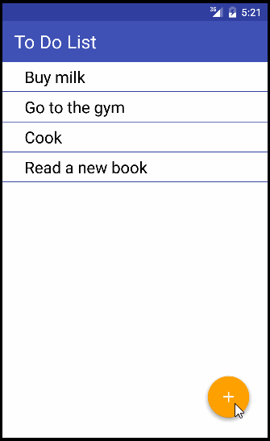

# To do Application

This is an Android application to track to do tasks.

Time spent: 15 hours spent in total

Completed user stories:

 * [x] Required: Create a to do task
 * [x] Required: Delete a to do task
 * [x] Required: Update a to do task
 * [x] Required: Display to do tasks
 * [x] Optional: Persist the todo items into SQLite instead of a text file
 * [x] Optional: Improve style of the todo items in the list using a custom adapter
 * [x] Optional: ITweak the style improving the UI / UX

GIF created with [LiceCap](http://www.cockos.com/licecap/).
